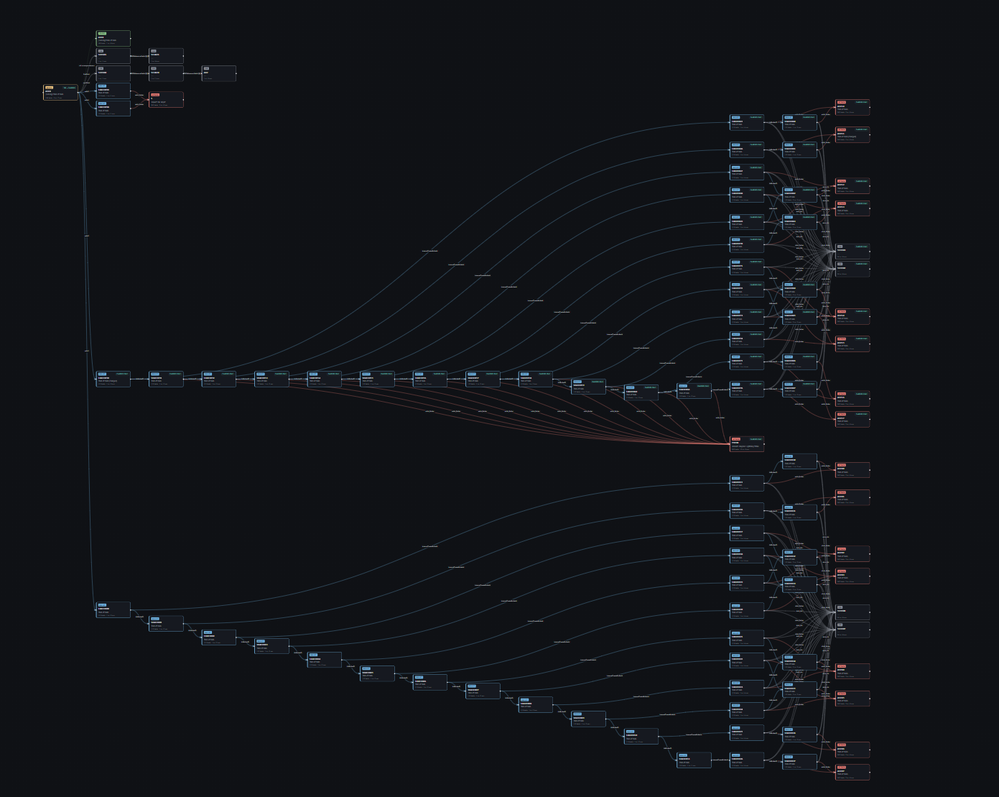
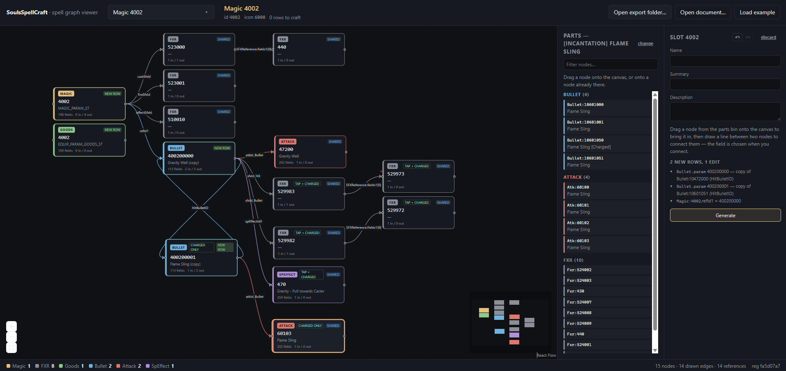

# Souls Spell Craft

A visual editor for Elden Ring spells, inspired by the likes of [FXR Playground](https://fxr-playground.pages.dev/)
and staring into the abyss of params in [Smithbox](https://github.com/vawser/Smithbox).

Open a spell and you get its whole worktree on a canvas. Click any node to read or change
"every" field on it. Or start from an empty slot and build a new spell by dragging pieces out
of existing ones.



It writes a patched `regulation.bin` next to the game's own, so nothing you do touches the
original files. Delete `launch/patched/` and you're back to vanilla.

## What you need

[Node.js](https://nodejs.org/), a copy of Elden Ring, and [me3](https://github.com/garyttierney/me3)
to launch the game with your edits — it overlays a folder onto the game's data instead of
modifying anything ([install guide](https://me3.help/en/latest/user-guide/installation/)).

No game data lives in this repo, and you don't need Rust — `bin/xtask.exe` is prebuilt.

## Getting started

```bash
npm install
```

Copy `config.example.json` to `config.json` and point `gameDir` at your install — the `Game`
folder, the one with `regulation.bin` sitting in it:

```json
{
  "gameDir": "C:/Games/Steam/steamapps/common/ELDEN RING/Game",
  "patchDir": "launch/patched",
  "exportDir": "data/reference/generated/spell-export"
}
```

That's the whole config. `patchDir` is the working copy me3 overlays, `exportDir` is where the
spell documents land, and both get made for you.

Then:

```bash
bin/xtask.exe init                # copy regulation.bin and friends out of your install
bin/xtask.exe spell export --all  # 317 spells, a couple of seconds
npm run dev
```

Every spell shows up in a dropdown. Pick one, and it draws.

## Editing a spell

Click a value, change it, hit **Save to regulation.bin**. Then launch:

```bash
me3 launch --auto-detect -p launch/launch_er_patched.me3
```

## Building a new spell

There's a **Craft** panel — hit **+ Add slot** to grab an empty spell slot, pick it, then drag
rows out of any spell onto the canvas and wire them together.

`Ctrl+Z` steps the whole graph back. Crafts save as you go, so you can close the tab and find
it waiting under **Unfinished**.

## Real names and effects

The above runs on `regulation.bin` alone. Spell names and visuals live inside the game's packed
archives, so you need [UXM Selective Unpack](https://github.com/Nordgaren/UXM-Selective-Unpack)
once to pull these three out into your install:

```
msg/engus/item_dlc02.msgbnd.dcx              names and descriptions
sfx/sfxbnd_commoneffects.ffxbnd.dcx          effects
sfx/sfxbnd_commoneffects_dlc02.ffxbnd.dcx    DLC effects
```

> **Unpack only — don't press Patch.** Patch rewrites `eldenring.exe` to load loose files,
> which you don't need because me3 does the loading, and a modified exe locks you out of
> online play.

Then pick them up and explode the effect binders:

```bash
bin/xtask.exe init         # grabs the newly unpacked files
bin/xtask.exe sfx unpack   # .ffxbnd.dcx -> a folder of loose .fxr files
```

Packing back up happens for you when you save an effect edit.

## Editing the visuals

Selecting an effect node shows which `.fxr` it lives in. Colour and scale you can change right
there, and during a craft those write into a **copy**, same rule as a param row. Anything
beyond that, the editor hands you the file path and a link to
[FXR Playground](https://fxr-playground.pages.dev/).

## Things that will trip you up

- **No `msg/` means no real spell names.** Names fall back to the community Paramdex list, and
  descriptions are simply absent.

- **No `sfx/` means the effect panel can't resolve files.** Same cause, different symptom.

- **Icons render as numbers.** They're in the game's TPF archives; reading those is separate
  work and not done yet.

- **Nothing validates your values.** The game will load a regulation describing an absurd spell
  exactly as readily as a stable one. That's on you — if you loop a HitBulletID to itself, or
  to a parent bullet, there is nothing stopping you...

  

## Commands

```bash
npm run dev                       # the editor
npm run build                     # production build, no bridge

bin/xtask.exe init                # seed launch/patched/ from your install
bin/xtask.exe spell export --all  # the spell documents the editor reads
bin/xtask.exe sfx unpack          # explode the SFX binders
```

Run `bin/xtask.exe` bare for the rest.

## Layout

```
src/lib/         domain logic: pure, knows nothing about React
src/hooks/       state and coordination, one hook per job
src/components/  rendering: Editor/ chrome, Spell/ selection, Craft/ assembly
plugins/         the dev-server bridge that runs bin/xtask.exe
bin/xtask.exe    the engine — the only thing that opens regulation.bin
launch/patched/  your working copy; me3 overlays this onto the game
```

`src/spell-document.ts` is generated from the engine's Rust types — don't edit it by hand. The
engine itself lives at [SoulsSpellCraft-engine](https://github.com/Gingerlief/SoulsSpellCraft-engine).

## Thanks

- EvenTorset — [FXR Playground](https://fxr-playground.pages.dev/) and
  [cccode/fxr](https://github.com/EvenTorset/fxr); its nodal editing system was the
  inspiration for the spell crafting design
- InfernoPlus et al. — [JortPob](https://github.com/infernoplus/JortPob), which inspired the
  idea of cursed spell crafting
- Vawser et al. — [Smithbox](https://github.com/vawser/Smithbox), god tier tool
- Rusty — [The Definitive Guide To Elden Ring Bullet Editing](https://www.youtube.com/watch?v=rIDQSJ39JUM),
  masterwork sassy bullet editing video tutorial
- The Souls modding community overall, and its endless resources
